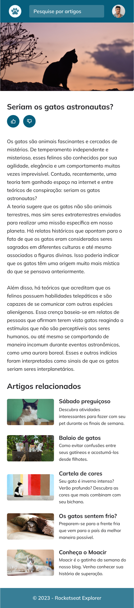

# Blog de gatinhos

Projeto do curso **Explorer** da **Rocketseat**, em que consiste em desenvolver o layout de um blog usando os conhecimentos passados nas seções de HTML e CSS, utilizando Grid, Flexbox, animações, variavés, e responsividade, tendo sido desenvolvido com _mobile first_.

## Projeto em desktop

## Projeto em mobile
